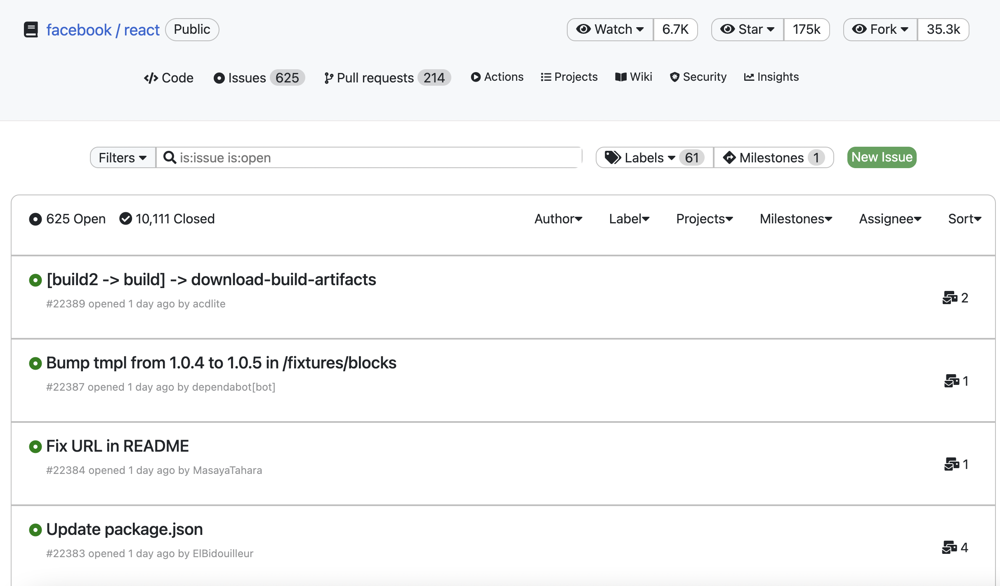
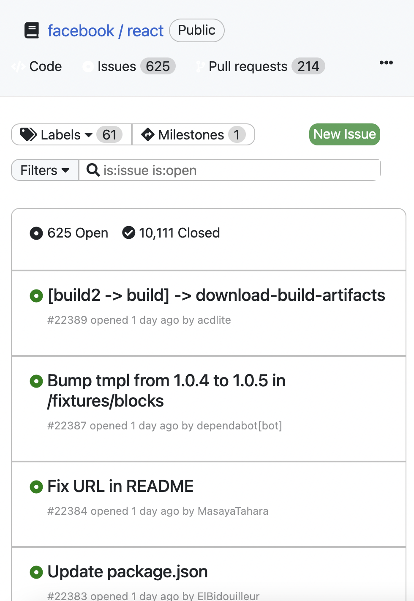

# GITHUB ISSUES UI

A GitHub issues UI assignment made in 3 hours

## Table of contents

- [Overview](#overview)
  - [Screenshot](#screenshot)
  - [Links](#links)
- [My process](#my-process)
  - [Built with](#built-with)
  - [What I learned](#what-i-learned)
  - [Useful resources](#useful-resources)
- [Author](#author)
- [Acknowledgments](#acknowledgments)

## Overview

It is a Github issues UI made in HTML, CSS and Javascript. Fontawesome icons and Bootstrap is also used.

### Screenshot

- Larger Screen Size

- Smaller Screen Size


### Links

- Live Site URL: [Live Website](https://kurosakicoder.github.io/GithubIssuesUI/)

## My process

First, I designed the rough sketch using HTML and CSS and added Fontawesome icons and Bootstrap. Then, I started coding in Javascript and also made my last changes in HTML and CSS.

### Built with

- HTML
- CSS
- JavaScript
- Fontawesome icons
- Bootstrap 

### What I learned

Coding Challenges are a great way to learn. I learnt to use ternary operators in Javascript innerHTML.

```js
<div class="assign-message">
  ${data[i].assignee ? `<p class="issues-elementPtagStyle5"></p>` : ''}        
  ${data[i].comments > 0 ? `<p class="issues-elementPtagStyle6"><i class="fas fa-mail-bulk"></i> ${data[i].comments}</p>` : ''}  
</div>
```

### Useful resources

-  Github ISSUES API [LINK](https://api.github.com/repos/facebook/react/issues)

## Author

- LinkedIn - [Khaidem Sandip Singha ](https://www.linkedin.com/in/khaidemsandip/)
- Twitter - [@KurosakiCoder](https://twitter.com/KurosakiCoder)

## Acknowledgments

I have done this project from scratch by referring to the above useful resources link.

